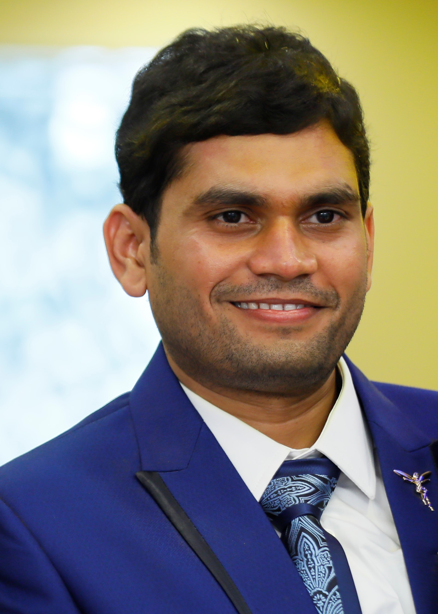

```{r setup, include=FALSE}
knitr::opts_chunk$set(echo = TRUE)
```

<div style = "float:left; position:relative; top: -0px;">

```{r picture, echo=FALSE, out.width = "25%", out.extra='style="float:left;margin: 0px 20px 0 0"'}

```
<p>
###   I am a Mechanical Engineer with 12+ years of experience in Aerospace stress analysis, pursuing my Masters in Data Science at SMU, Dallas, TX.

###   I am from India, and currently residing in Nashville, TN. 
###   I love to play all kinds of sports few being Basketball, Badminton, Pingpong and Cricket. Watching action animation, action movies and conceptual thinking are some of my hobbies.

### Do visit next tab for the CaseStudy-01 as part of Doing Data Science program.
</p>
</div>


